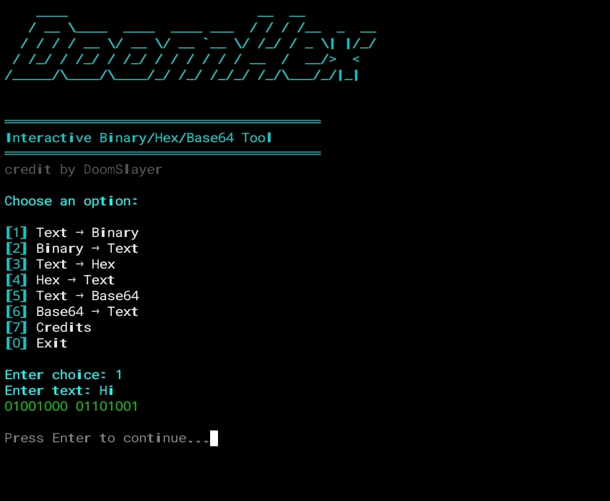

# DoomHex 🔹 Interactive Binary/Hex/Base64 Converter


Welcome to **DoomHex**, your ultimate Python-based tool for encoding and decoding text!  
Whether you're a tech enthusiast, programmer, or just curious about data representation, DoomHex brings a **fun, interactive, and colorful experience** to the terminal.  

---
<h1>ScreenShot</h1>


## 🚀 Features

- **Text ↔ Binary**: Convert any text into binary and vice versa, perfect for learning or experimentation.  
- **Text ↔ Hex**: Encode text into hexadecimal format and decode it back effortlessly.  
- **Text ↔ Base64**: Transform your text to Base64 for encoding, data storage, or secure sharing.  
- **Dynamic ASCII Banner**: DoomHex automatically generates a stylish ASCII banner using a slanted font each time it starts.  
- **Spinner Animation**: Simulated loading animations for a professional and interactive feel.  
- **Credits Section**: Display your Discord & GitHub contact info right inside the tool.  
- **Lightweight & Self-contained**: Runs entirely in your terminal without external internet or files.  
- **Fully Interactive Menu**: Easy-to-navigate menu with color-coded options for clarity.  

---

## 🌟 Why DoomHex?

DoomHex is not just a converter — it's **an experience**. With vibrant colors, interactive spinner effects, and automatic ASCII banners, it makes working with binary, hexadecimal, and Base64 formats **both fun and educational**.  

Whether you're a student learning about data encoding, a developer testing outputs, or someone who loves terminal tools, DoomHex makes **encoding and decoding tasks smooth, fast, and visually appealing**.

---

## 💻 Installation

1. Make sure you have Python 3 installed.  
2. Install required libraries (Termux / Linux / Windows):

```bash
pip install colorama pyfiglet
```
3. Download DoomHex.py from this repository.
```
git clone https://github.com/DoOmSlAeYr/Doom-Hex
```
4. Run the tool:

```

cd DoomHex python DoomHex.py
```

---

📚 Usage

1. Launch DoomHex.


2. Choose your desired option from the interactive menu:

Text → Binary

Binary → Text

Text → Hex

Hex → Text

Text → Base64

Base64 → Text

Credits / Contact


3. Input your text, binary, hex, or Base64 string.


4. Enjoy the converted output — it stays on screen until you press Enter.


---

🔧 How it Works

Binary Conversion: Converts each character into an 8-bit binary sequence.

Hex Conversion: Converts text bytes into hexadecimal representation.

Base64 Conversion: Encodes and decodes strings according to standard Base64 rules.

Interactive Spinner: Simulates processing for a realistic tool feel.

Dynamic Banner: Uses pyfiglet slanted font to generate ASCII art from the tool name automatically.


---

📢 Credits

This project was created and maintained by DoomSlayer.

Discord: 7o9l

GitHub: DoOmSlAyEr


Feel free to star ⭐ the repository and share feedback.


---

⚡ License

Feel free to use, modify, and distribute DoomHex for educational or personal purposes.
Respect the credits if you share the project publicly.

---
